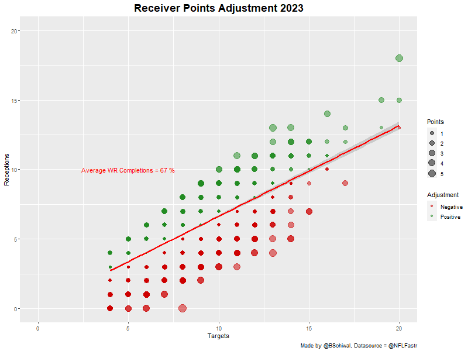
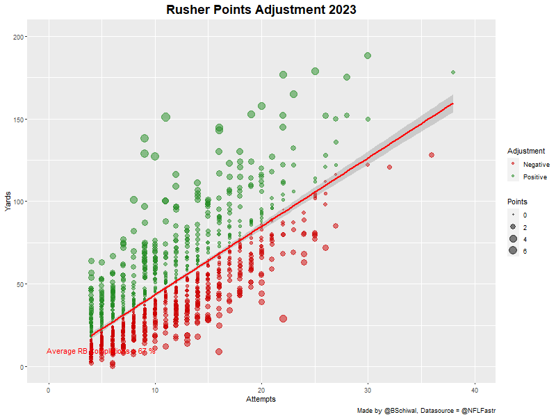
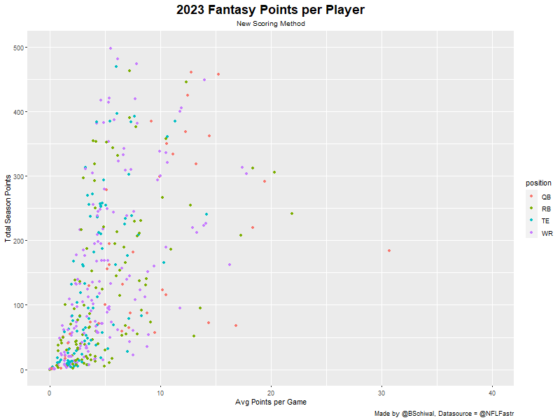

# FFAnalysis

##Introduction

I like fantasy football but there are some things that have always bothered me about it. First, standard scoring is not fun if you don't have a good Running Back because they always are the bell-cows for the team. Second, PPR tends to reverse that and make the Running Backs more of an afterthought. 

I have been working to develop an addition to skill position scoring that both rewards efficiency for the position and equalizes the points scored by each position group. To do this the goal is to create a point adjustment for each group that will give a small positive or negative adjustment based around the league average for each skill group. 

###expectations and Limitations

To accomplish this goals I had to set expectations and understand the limitations for the project. There were several considerations I needed to put front and center. 

'Fantasy platforms have limited category options for scoring' 
'You can only give and remove points to two significant digits'
'I want players above the average to get a positive adjustment'
'Players below the average line should also get a negative point adjustment'
'When all adjustments are made there should be relative parity among position groups'
'The average of all points adjustments should be as close to zero as possible'

So I loaded up NFLFastr into RStudio and started doing some background statistical analysis. 

###Quarterback Analysis

I first took a look at the quarterbacks I filtered and grouped 2021 NFL season Play by Play data to include only pass plays and passers with more than 3 attempts and calculated a per game passes, completions, incompletions, and completion percentage for each passer.
'''
qbstats <-pbp%>% 
  filter(
    play_type=="pass",
    pass_attempt == 1
  )%>%
  group_by(game_id,passer_player_name)%>%
  summarise(
    attempts = sum(pass_attempt),
    completions = sum(complete_pass),
    incompetions = sum(incomplete_pass),
    comp_pct= completions/attempts
  )%>%
  filter(attempts>3)
'''

After doing this, I was able to calculate the average completion percentage as 60% for all passers across the whole season. 

'''
> avgqbcomp<-round(mean(qbstats$comp_pct),2)
> avgqbcomp
[1] 0.6
'''
For quarterbacks you can give points for each pass attempted, completed, and each incomplete pass. So an adjustment can be made for each pass attempt where you give the passer points for each completion, and corresponding lesser amount of negative points for each attempt. This means that a completion will be worth positive points and an incompletion will be worth negative points. The points adjustment just needs to be fitted around a linear model of all games. Doing some napkin math, -1 points per Attempt and +1.6 per completion should result in the proper fit. But it was a little off, this means that there are some outliers that are dragging the average down. After some trial and error I came to 1.65 points for each completion and -1 per attepmt giving the results I needed.

Here are are the final results. 

###Other Position Groups

I used the same method to adjust receiving and rushing attempts. However it was a little more complicated because the options for points are more limited on each. The to get the proper results.  However, in the end I found the following adjustments gave the best results. 

'''
Rushers receive an extra:
-.26 points per attempt
.06 points per yard

Receivers get an extra: 
1 point per reception
-.66 points per target

'''
*NOTE* these adjustments are above standard PPR scoring, so the receivers will get 2 points per reception and rushers get .16 points per yard. 

Here are the final results for the remaining positions. 

###COMPLETE COMPARISON

To wrap things up, in these last two charts you can compare the distribution of players scoring between the two methods. Quarterbacks are weighted closer to the rest of the group and WR/RB are dispersed more evenly throughout the body of the chart. 

###PLAYER SCORING DATA FILES

Here are links to CSV files that show points totals for the season, per game, and one with just the top players in each position group. 

[All Player Points Per Game](./data/ff_allplayer_pergame_points.csv)

[All Player Points Season Total](./data/ff_allplayer_totalseason_points.csv)

[Top Player Season Totals](./data/ff_top_players_points.csv)
